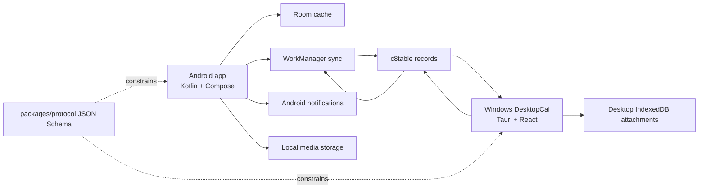

# Android Companion App Concept

## Goal

Build a separate Android companion experience for DesktopCal. The Android app is not a small month
calendar. It is a mobile capture, reminder, and field-update tool that syncs with the same c8table
event backend used by the Windows desktop app.

## Product Positioning

Working name: `PulseLink`.

The desktop app remains the planning surface: dense views, c8table field management, batch editing,
reports, and long-form review. The Android app becomes the pocket surface: fast capture, camera and
file attachment, reminders, and quick status updates.

## Core User Stories

- Capture an event from text, voice, photo, or shared file while away from the desktop.
- Parse a natural-language note into title, date, time, unit, event type, importance, note, and
  attachment metadata.
- See a mobile-first action list for today, the next few days, overdue duration items, and high
  importance work.
- Receive Android notifications for event and duration items.
- Add mobile attachments locally first, then sync metadata through c8table so the desktop app can
  see the event context.
- Edit an event on desktop and see the Android reminder/list update after sync.

## Non-Goals For The First Android MVP

- Do not recreate the desktop month calendar as the primary mobile screen.
- Do not require real-time websocket sync in the first version.
- Do not require c8table remote attachment upload until the table/backend supports a stable
  attachment field or separate object storage.
- Do not bind Android builds into the root `npm` or `uv` desktop build; Android stays behind an
  explicit APK command.

## Screen Model

### Capture

The first screen action is capture. It supports:

- Text quick add.
- System voice input.
- Camera/photo picker.
- Share target from other Android apps.

Capture always opens a confirmation card before upload.

### Now

The default mobile list groups items by action pressure:

- Overdue duration items.
- Today.
- Tomorrow and next 3 days.
- High importance later items.

### Event Detail

Detail edits the same semantic fields as desktop:

- Title.
- Date.
- Time.
- Unit/source.
- Event type: `事件` or `持续`.
- Importance: 1-5.
- Note.
- Attachments.

### Sync

The sync screen shows:

- c8table connection state.
- Last pull time.
- Last push time.
- Local unsynced changes.
- Attachment migration status.

## Architecture Boundary

## Recommended Android Stack

- Kotlin.
- Jetpack Compose.
- Room for local cache.
- WorkManager for background pull/push.
- OkHttp or Ktor client for c8table API.
- DataStore for local token and settings.
- Android notification channels for reminders.

## Phasing

### Phase 0: Protocol And Skeleton

- Keep this repository as the monorepo.
- Add protocol schemas under `packages/protocol`.
- Add `apps/android/README.md` as the Android app boundary.
- Verify Android SDK/JDK availability before adding Gradle files.

### Phase 1: Android MVP

- Create `apps/android` Kotlin Compose project.
- Store c8table token locally with app preferences.
- Pull entries from c8table into the mobile list.
- Render mobile `Now` list and detail view.
- Create events through c8table structured fields.
- Schedule local notifications.

### Phase 2: Capture And Attachments

- Add text/voice/photo capture.
- Store attachment files locally on Android.
- Sync attachment metadata in the entry record.
- Show Android-created attachment metadata on desktop.

### Phase 3: Pairing And Migration

- Add desktop pairing QR for same-LAN attachment transfer.
- Add remote attachment migration when c8table or object storage is ready.
