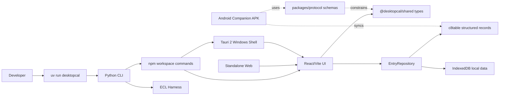
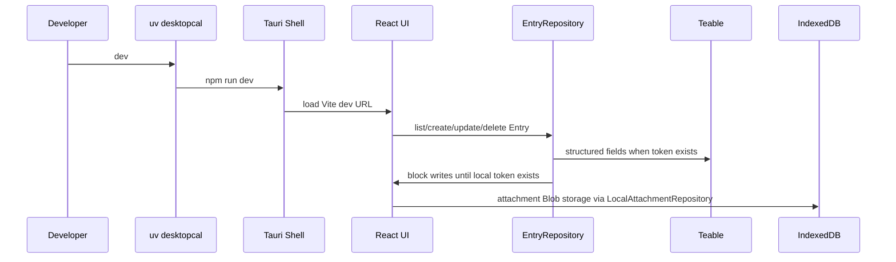

# Architecture

## 1 Overview

DesktopCal is a desktop-first calendar and time-recording tool with a standalone web surface and an
Android companion package. The runnable Windows product uses Tauri 2 for the shell, React +
TypeScript for the UI, shared TypeScript types for domain contracts, repository abstractions for
event persistence, and a Python CLI managed by uv as the single human-facing desktop command
surface.

## 2 System Shape

## 3 Layers

| Layer | Path | Responsibility |
| --- | --- | --- |
| L0 | `packages/shared` | Domain types shared across UI and integration code |
| L1 | `apps/web/src/domain` | Date grouping and UI-facing domain behavior |
| L1 | `apps/web/src/repositories` | Entry repository interfaces, c8table structured records, local events, and local attachments |
| L2 | `apps/web/src/components` | React layout, month calendar, event drawer, upcoming list, and report preview |
| L2 | `apps/web/src` | React app composition and interaction state |
| L3 | `apps/desktop/src-tauri` | Native window shell and Tauri runtime |
| Android | `apps/android` | Kotlin + Compose companion package for mobile c8table list and quick create |
| Planned | `packages/protocol` | Cross-device JSON Schema contracts before Android/Kotlin code generation exists |
| Tooling | `src/desktopcal` | uv command orchestration, environment checks, harness commands |

## 4 Event Data Flow

## 5 Teable Boundary

c8table integration lives behind `EntryRepository`. `TeableJsonEntryRepository` stores one event per
record at `https://c8table.com/api/table/tbl2wWI7diI2vs5anMs/record` with `fieldKeyType=name`.
On startup it ensures the table has structured fields for 标题, 日期, 时间, 单位, 类型, 重要性, 完成,
备注, 附件, 附件元数据, 本地ID, 创建时间, and 更新时间. The older `单行文本` column is kept as a
readable title mirror only; if it still contains a previous JSON envelope, the repository parses
that row and PATCHes the structured columns back into c8table.

Personal API tokens are runtime/local configuration only. The standalone web surface and packaged
Windows executable also support c8table OAuth 2.0 PKCE; OAuth access tokens are stored in browser
local storage and refreshed with the stored refresh token. No token or OAuth secret is committed to
git-tracked files.

The frontend treats c8table as the event source of truth. Desktop, standalone web, and Android load
records from the same table, write create/update/delete operations back to c8table, and poll for
table-side changes so the table and all clients remain linked.

## 6 Desktop Window Boundary

On Windows, the Tauri shell runs as a normal decorated, taskbar-visible window. Earlier desktop
wallpaper attachment was removed because it made interaction unreliable. The web UI may still use
soft translucent surfaces, but the native shell should stay a regular window until there is a
separate, tested desktop-widget mode.

## 7 Unit And Type Presentation Boundary

Users edit semantic unit/source values. Unit decides the marker shape. Event type decides fill:
`持续` uses a solid marker and `事件` uses a hollow marker. UI components do not expose raw shape or
fill controls as primary user inputs.

## 8 Attachment Boundary

`LocalAttachmentRepository` stores Blob data in IndexedDB and event records store metadata plus
`localBlobKey`. When c8table supports an attachment field on the target table, the repository can
upload local files and preserve `teableAttachmentId` for migrated attachments.

## 9 Android Companion Boundary

The Android app is a different mobile experience, not a resized month calendar. The first package
supports c8table token storage, event listing, field creation, and quick event creation. Desktop
remains the dense planning, c8table administration, and report surface.

Android remains constrained by the shared protocol:

- `docs/ANDROID_COMPANION.md` describes product boundaries and phases.
- `docs/SYNC_PROTOCOL.md` describes cross-device sync behavior.
- `packages/protocol/schemas/entry.v1.schema.json` is the schema-first contract shared by desktop
  and Android.
- `apps/android/README.md` documents the local debug APK build and current package boundary.
