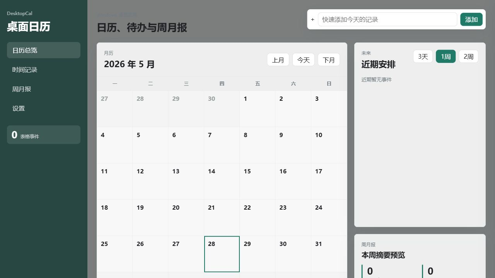
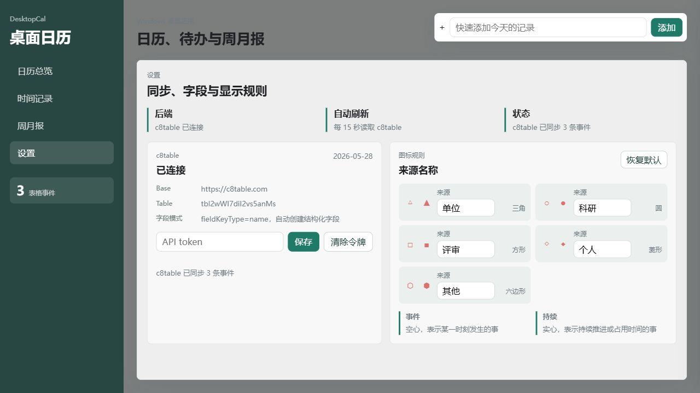
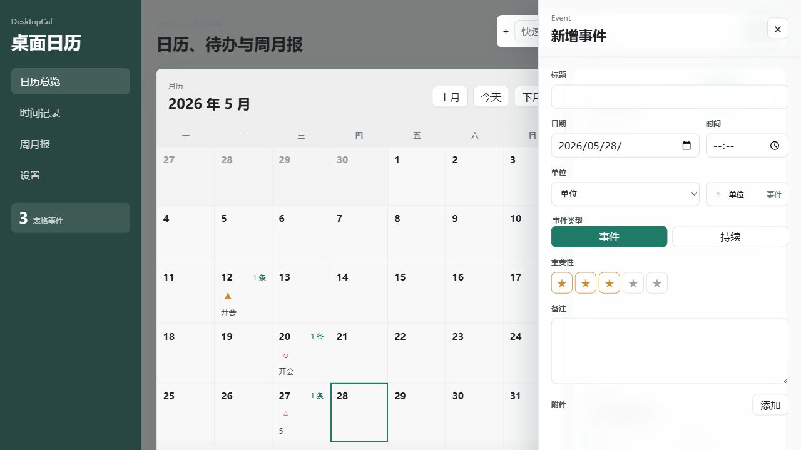

# DesktopCal 使用说明

DesktopCal 是一个 Windows 桌面日历窗口。它把事件数据同步到 c8table，附件文件先保存在本机 IndexedDB；常用视图、日历模式、右侧抽屉和 c8table 表格会围绕同一批事件数据联动。



## 1. 基本界面

左侧是导航和事件数量，中间是当前视图，右侧是近期安排和周月报预览。默认进入 `常用视图`，展示今天前 3 天到后 11 天的滚动安排；`日历模式` 才是完整月历。顶部快速添加会先解析自然语言，再打开抽屉让你确认。

导航区包含四个入口：

| 入口 | 用途 |
| --- | --- |
| 常用视图 | 查看最近 15 天，单日卡片更大，适合密集安排 |
| 日历模式 | 查看月历、双击日期新增事件、点击已有事件编辑 |
| 时间记录 | 按事件列表查看记录，用于后续统计投入时间 |
| 周月报 | 根据事件数据生成周报/月报预览 |
| 设置 | 配置 c8table token，查看字段同步状态和图标规则 |

## 2. 连接 c8table

进入 `设置` 页面后，在 `c8table` 卡片里保存 API token。token 只保存在本机运行时配置，不写入仓库。

保存 token 后，应用会连接：

| 配置 | 值 |
| --- | --- |
| Base URL | `https://c8table.com` |
| Table ID | `tbl2wWI7diI2vs5anMs` |
| 字段 key | `name` |

应用会自动检查并创建这些字段：

| 字段 | 含义 |
| --- | --- |
| 标题 | 事件标题 |
| 日期 | 事件所属日期 |
| 时间 | 发生时间，可为空 |
| 单位 | 来源/分类，用来决定月历图形 |
| 类型 | `事件` 或 `持续`，用来决定空心/实心 |
| 重要性 | 1 到 5 星 |
| 备注 | 长文本备注 |
| 附件 | c8table 附件字段；可用时上传附件 |
| 附件元数据 | 本地附件的备份元数据 |
| 本地ID | 前端事件稳定标识 |
| 创建时间 | 创建时间 |
| 更新时间 | 更新时间 |

如果表里已经有旧版 JSON 写在 `单行文本` 字段，应用读取时会解析它，并把内容迁移回上面的结构化字段。迁移后，`单行文本` 只作为可读标题镜像，不再是主要数据存储。



## 3. 新增事件

在 `常用视图` 或 `日历模式` 里双击某一天，会打开右侧事件抽屉，并自动填入该日期。



填写内容后点 `保存`。保存成功后：

- 月历格子会显示事件数量、标记和第一条标题。
- 右侧近期安排会刷新。
- c8table 对应记录会新增或更新。
- 每 15 秒会重新读取 c8table，表格侧改动也会回到前端。

顶部快速添加不会直接写入事件。它会先解析输入内容，然后打开事件抽屉让你确认。可识别日期、时间、来源、事件类型和重要性，例如：

```text
明天 15:30 持续 单位 5星 中央巡检
```

在 `设置` 页保存 AI 解析 API key 后，快速添加会优先调用 OpenAI-compatible `/chat/completions` 接口解析自然语言；调用失败时回退本地规则。AI key 只保存在本机 localStorage，不写入仓库。

## 4. 编辑事件

点击月历格子里的已有事件标题，会进入编辑模式。修改后保存，应用会向 c8table 发送 PATCH 更新对应 record。

删除事件时，应用会删除 c8table 对应 record。删除后月历和近期列表会同步刷新。

## 5. 来源、形状、事件类型

这里的逻辑分两层，不要混在一起：

| 你选择的字段 | 决定什么 |
| --- | --- |
| 来源 | 月历上显示什么形状 |
| 类型 | 形状是空心还是实心 |

默认来源示例：

| 单位 | 月历形状 |
| --- | --- |
| 单位 | 三角 |
| 科研 | 圆形 |
| 评审 | 方形 |
| 个人 | 菱形 |
| 其他 | 六边形 |

这些来源名称可以在 `设置` 页编辑。形状保持固定规则，避免每个事件来源的视觉含义漂移。编辑后会保存到本机 localStorage，并立即影响月历、近期列表和事件抽屉的显示。底层事件仍保存稳定的来源 ID，所以改显示名称不会让已有记录丢失。

类型规则：

| 类型 | 显示 | 含义 |
| --- | --- | --- |
| 事件 | 空心 | 某个时间点发生的事 |
| 持续 | 实心 | 持续一段时间或需要推进的事 |

所以不是“选择三角”，而是选择“单位”；单位的展示规则让它显示成三角。也不是单独选择空心/实心，而是选择“事件”或“持续”。

## 6. 重要性

重要性用 1 到 5 星表示。星级越高，月历标记越醒目，周月报和高重要度统计也会优先展示。

## 7. 备注和附件

备注直接写入 c8table 的 `备注` 字段。

附件分两部分处理：

| 内容 | 存储位置 |
| --- | --- |
| 文件 Blob | 本机 IndexedDB |
| 文件名、类型、大小、本地 key | c8table 事件记录 |
| c8table 附件 ID | c8table 附件字段可用后保存 |

当前策略是先保证本地附件不丢，再把附件元数据同步到事件记录。目标表存在可用附件字段时，应用会尝试把本地附件上传到 c8table。

## 8. 窗口行为

Windows 桌面版当前使用普通窗口模式：

- 有系统标题栏和边框。
- 显示在任务栏。
- 可以最小化、最大化、移动和调整大小。
- 不再贴到桌面 WorkerW/Progman 层。

之前的桌面贴附模式会导致鼠标交互不稳定，所以当前可用版本以普通窗口为准。后续如果需要桌面组件，应作为独立模式重新验证。

## 9. 常见问题

### 表里还是只有 `单行文本`

确认 `设置` 页面已经保存 API token，并且 token 有创建字段和写 record 的权限。保存后刷新页面，应用会自动建字段并迁移旧 JSON 行。

### 保存按钮不可点

标题不能为空。至少填写标题后才能保存事件。

### 附件重启后还在吗

同一台电脑、同一浏览器/应用数据目录下会保留。附件 Blob 在本机 IndexedDB；c8table 里保存附件元数据和本地 blob key。

### 表格改了，前端多久更新

应用每 15 秒读取一次 c8table。也可以刷新页面立即重新读取。

### token 会不会提交到仓库

不会。token 只通过设置页或本机 `VITE_TEABLE_TOKEN` 读取，不写进 git 跟踪文件。

## 10. 启动方式

开发模式：

```powershell
uv run --no-editable desktopcal dev
```

打包后的程序：

```powershell
apps\desktop\src-tauri\target\release\desktopcal.exe
```

安装包位置：

```powershell
apps\desktop\src-tauri\target\release\bundle\nsis\DesktopCal_0.1.0_x64-setup.exe
```
